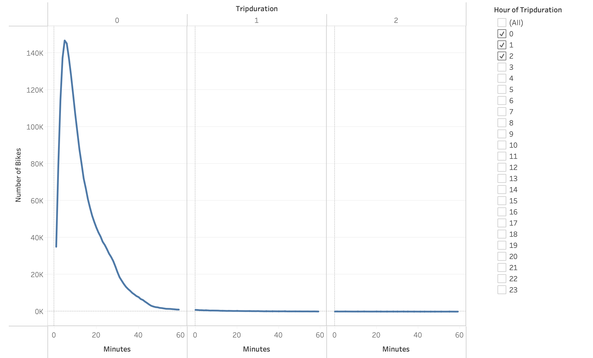
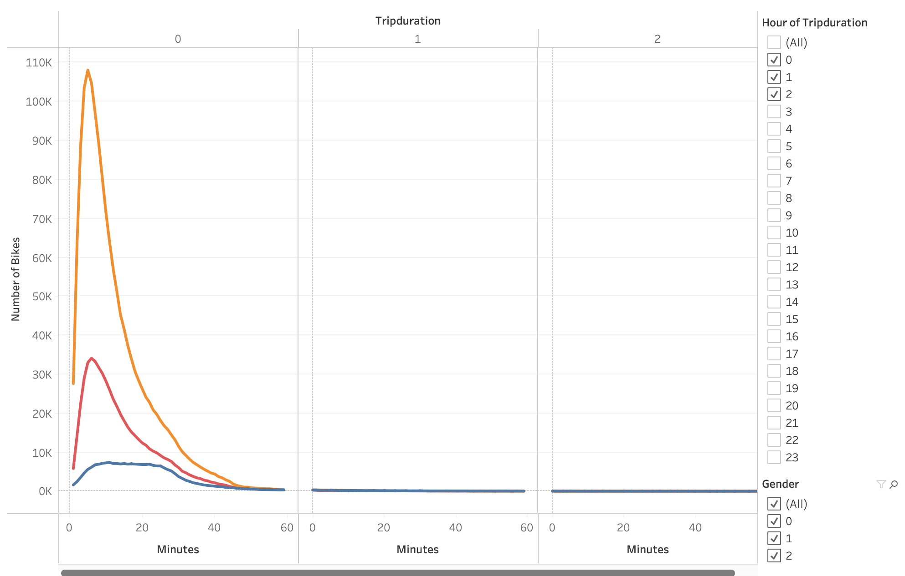
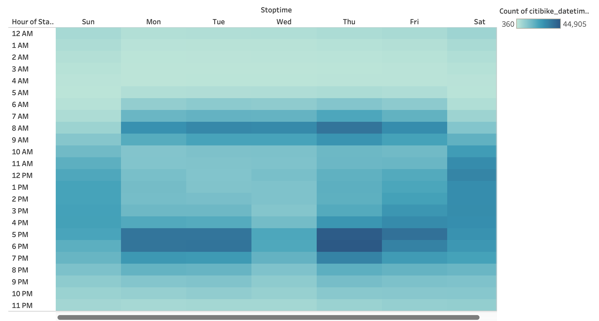
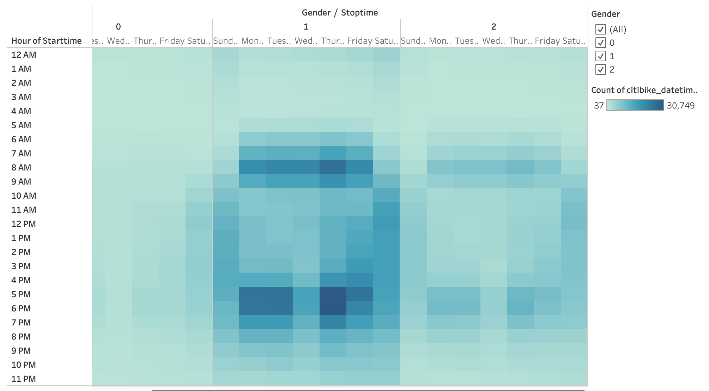

# Bike-Sharing

[link to dashboard](https://public.tableau.com/app/profile/luiszavala/viz/CitiBike_Challenge_16639013167840/NYCCitiBikeAnalysis?publish=yes)

### Overview
* Analyzing the data from NYC’s CitiBike bike sharing program to gather detail on whether or not it would be a good idea to open up a CitiBike program in Des Moines, Iowa.
* Show the length of time that bikes are checked out for all riders and genders
* Show the number of bike trips for all riders and genders for each hour of each day of the week
* Show the number of bike trips for each type of user and gender for each day of the week.

### Results:

* As the figure shows above, most trips lasted to about 20 minutes.

* Looking between our choices of Gender, used the bike more often but around the same length of time as Female and Unknown. 

* Peak times would be weekdays in the morning but also in the evening. (roughtly when people get to and off of work.)

* Looking at Gender differences we see again men used the majority of the bikes but the hours of peak usage remained the same.

* Most of our susbscribers are men using the bikes during the weekdays. (possibly commuting to work)

### Summary:
* Based on the data and link provided above, looking at the month of August in NYC’s bike sharing program. The data points towards a positive in opening up a bike sharing program in Des Moines. Looking through the provided storyboard we see that around the time generally people begin to get off work we see an increase in usage. 

